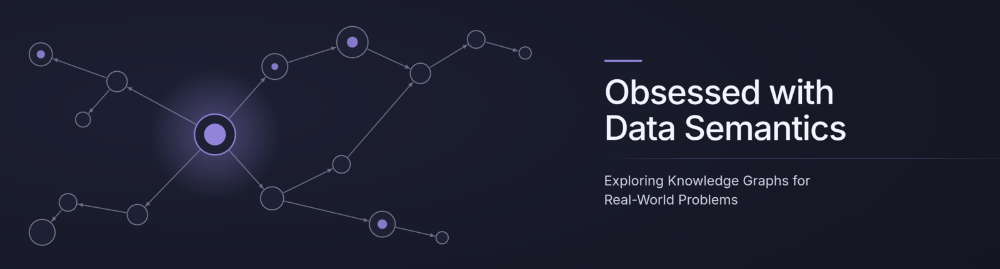

  

<h1 align="center">Hi, I'm Samuel Bustamante&nbsp;👋</h1>

  <b>Software Engineer &amp; Researcher</b> · Knowledge Representation · Rust · Web Semantics
   
  Full-time researcher at <a href="https://www.weso.es/">WESO</a> (Web Semantics Oviedo) · Core maintainer of <a href="https://github.com/rudof-project/rudof">rudof</a>

  

  
  
  
  

  
  
  

---

## 🧠 About Me

<table>
<tr>
<td width="68%" valign="top">

I'm a software engineer and researcher based in **Spain**, working on **knowledge representation** and on
applying **knowledge graph** technologies to real-world problems.

- 🎓 MSc in **Web Engineering**, University of Oviedo
- 🔬 Full-time researcher at **[WESO](https://www.weso.es/)** — about to start my **PhD**
- 🦀 One of the main developers and maintainers of **[rudof](https://github.com/rudof-project/rudof)**, an open-source Rust library for working with RDF data shapes
- 🧩 Rust is my language of choice today, but I'm equally happy with whatever technology gets the job done best
- 🏗️ Big fan of architectural &amp; design patterns and the infrastructure side of software — systems that are not just *correct*, but well-structured and reliable from the ground up
- 💬 Ask me about **RDF, ShEx, SHACL, SPARQL** or why the borrow checker is your friend

</td>
<td width="32%" valign="top" align="center">

<i>me, allegedly validating a few million triples</i>

</td>
</tr>
</table>

---

## 🔭 What I'm Working On

  
  

  
  
  
  
  

---

## 💻 Tech Stack

**Languages**

**Semantic Web &amp; Knowledge Graphs**

**Tooling &amp; Infrastructure**

**Writing &amp; Research**

---

## 📊 GitHub Stats

<!--
  🐍 Contribution snake — uncomment this block AFTER the first successful run of
  .github/workflows/snake.yml (Actions tab → "Generate contribution snake" → Run workflow).
  The workflow publishes the SVGs to the `output` branch of this repo.

<picture>
  <source media="(prefers-color-scheme: dark)" srcset="https://raw.githubusercontent.com/samuel-bustamante/samuel-bustamante/output/snake-dark.svg" />
  <source media="(prefers-color-scheme: light)" srcset="https://raw.githubusercontent.com/samuel-bustamante/samuel-bustamante/output/snake-light.svg" />
  
</picture>
-->

---

<i>"It compiles" is a strong claim. "It validates against the shape" is a stronger one.</i>

  

⭐️ From [samuel-bustamante](https://github.com/samuel-bustamante)

